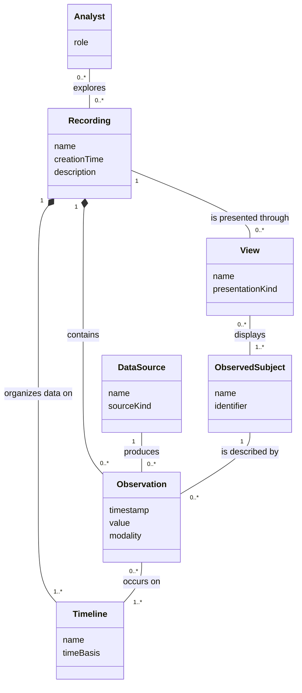

# Initial Domain Model

This conceptual model describes the domain of recording and exploring time-based, multimodal observations.
It represents the problem domain rather than Rerun's source-code structure.

The model treats an observation as a recorded fact about one observed subject from one data source.
A recording groups observations on one or more timelines, and analysts explore those observations through views.
