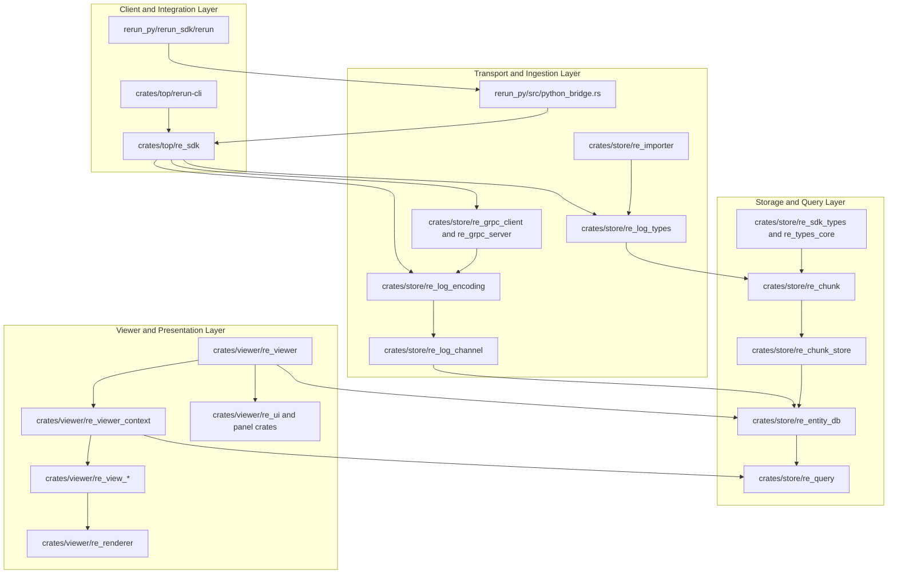
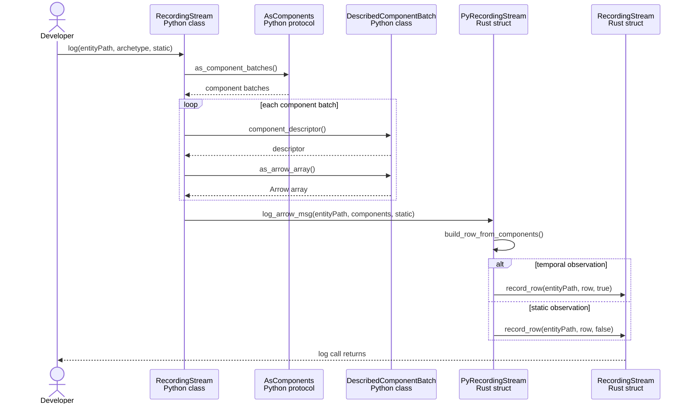
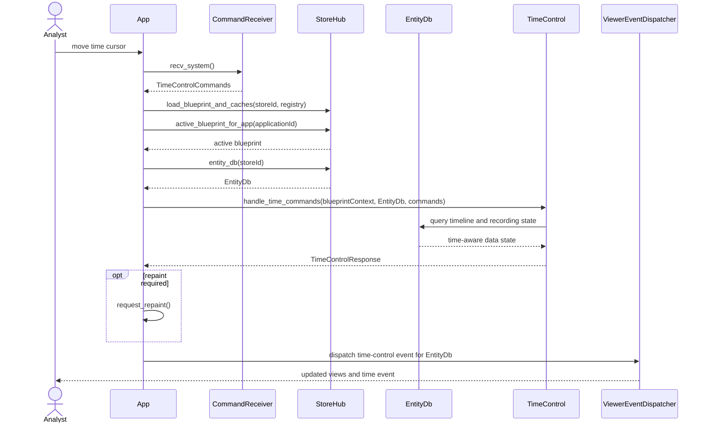

# Logical Architecture and Interaction Diagrams

## Architectural Style

Rerun uses a hybrid architecture built around layers, event-driven data flow, and client-server boundaries. The public SDK layer lives in `rerun_py/rerun_sdk/rerun` and `crates/top/re_sdk`; it converts user-facing archetypes and component batches into Arrow-backed rows and recording messages. The storage layer lives primarily in `crates/store`, where `re_log_encoding` transports messages, `re_entity_db` owns a recording's in-memory database, `re_chunk_store` stores chunked columnar data, and `re_query` provides read access. The presentation layer lives in `crates/viewer`; `re_viewer` coordinates application commands, `re_viewer_context` defines shared viewer abstractions, the `re_view_*` crates implement polymorphic views, and `re_renderer` performs rendering. Dependencies in the workspace manifests point from the SDK and Viewer toward shared storage and type crates rather than from storage back into the application UI. Data also moves asynchronously through sinks, receivers, and commands, so the result is not a textbook three-layer system: it is a layered core with event-driven ingestion and optional client-server transport.

Evidence:

- [`Cargo.toml`](../Cargo.toml) groups workspace members under `crates/store`, `crates/top`, and `crates/viewer`.
- [`crates/top/re_sdk/Cargo.toml`](../crates/top/re_sdk/Cargo.toml) depends on logging, encoding, SDK type, gRPC, and URI crates.
- [`crates/store/re_entity_db/src/entity_db.rs`](../crates/store/re_entity_db/src/entity_db.rs) defines `EntityDb` as an in-memory database backed by a `StorageEngine`.
- [`crates/viewer/re_viewer/Cargo.toml`](../crates/viewer/re_viewer/Cargo.toml) depends on storage, query, viewer-context, view, and renderer crates.
- [`crates/viewer/re_viewer_context/src/view/view_class.rs`](../crates/viewer/re_viewer_context/src/view/view_class.rs) defines the `ViewClass` interface implemented by concrete view crates.

## Logical Architecture Diagram



The arrows show compile-time or direct runtime dependency direction. The SDK and Viewer depend on shared transport, storage, and type facilities; storage does not depend on the Viewer application.

## Interaction Diagram 1 Log Time Aware Data

This diagram expands the `logObservation` system event from the earlier SSD. Every participant is a concrete class, struct, or protocol that can be opened in the repository.



Code evidence:

- [`rerun_py/rerun_sdk/rerun/recording_stream.py`](../rerun_py/rerun_sdk/rerun/recording_stream.py) defines the Python `RecordingStream` facade and its `log` method.
- [`rerun_py/rerun_sdk/rerun/_log.py`](../rerun_py/rerun_sdk/rerun/_log.py) calls `AsComponents.as_component_batches`, obtains each component descriptor and Arrow array, and invokes `bindings.log_arrow_msg`.
- [`rerun_py/src/python_bridge.rs`](../rerun_py/src/python_bridge.rs) defines `PyRecordingStream`; `log_arrow_msg` builds a pending row and calls the native `RecordingStream.record_row`.
- [`crates/top/re_sdk/src/recording_stream.rs`](../crates/top/re_sdk/src/recording_stream.rs) defines the native `RecordingStream` and `record_row` behavior.

## Interaction Diagram 2 Move the Time Cursor

This diagram expands `moveTimeCursor` from the Explore Recording Over Time SSD. It shows how a UI event becomes a command against the active recording rather than treating Rerun as a single black box.



Code evidence:

- [`crates/viewer/re_viewer/src/app/command_handling.rs`](../crates/viewer/re_viewer/src/app/command_handling.rs) receives `SystemCommand::TimeControlCommands`, obtains the active blueprint and `EntityDb` from `StoreHub`, invokes `TimeControl.handle_time_commands`, requests repainting when needed, and dispatches the resulting event.
- [`crates/viewer/re_viewer_context/src/store_hub.rs`](../crates/viewer/re_viewer_context/src/store_hub.rs) defines `StoreHub` and owns access to recording databases and blueprints.
- [`crates/store/re_entity_db/src/entity_db.rs`](../crates/store/re_entity_db/src/entity_db.rs) defines `EntityDb`, its timeline metadata, and its query-facing storage engine.

## Architectural Concern

The `App` type in `crates/viewer/re_viewer/src/app/command_handling.rs` is an architectural pressure point because command coordination is concentrated in one large implementation file. At the reviewed revision the file is about 1,940 lines long and handles time control, loading data sources, screenshots, open/import actions, recording commands, saving, navigation, closing recordings, clipboard work, and Viewer reset behavior. Its imports and `re_viewer/Cargo.toml` dependencies reach across data sources, entity storage, logging, rendering, panels, view classes, and UI concerns. This does not mean the file is incorrect, but it weakens separation of concerns: a change to one workflow can require understanding a broad controller, tests need more surrounding state, and the `App` coordinator becomes harder to change independently.

Representative code:

```rust
match cmd {
    SystemCommand::TimeControlCommands { .. } => { /* time and blueprint coordination */ }
    SystemCommand::LoadDataSource(data_source) => {
        self.load_data_source(store_hub, egui_ctx, &data_source);
    }
    SystemCommand::ResetViewer => self.reset_viewer(store_hub, egui_ctx),
    // many additional command families
}
```

## GRASP Findings

### Information Expert Applied Well

`EntityDb` is a strong Information Expert. It owns the recording's `StorageEngine`, entity paths, timeline metadata, manifest index, and ingestion statistics, and its methods answer recording-specific queries such as `timelines`, `time_range_for`, and `latest_at`. Giving these operations to `EntityDb` keeps knowledge about stored recording state with the object that has the required information.

```rust
pub struct EntityDb {
    store_id: StoreId,
    rrd_manifest_index: RrdManifestIndex,
    entity_paths: BTreeSet<EntityPath>,
    data_meta_per_timeline: DataMetaPerTimeline,
    storage_engine: StorageEngine,
    stats: IngestionStatistics,
}
```

Source: [`crates/store/re_entity_db/src/entity_db.rs`](../crates/store/re_entity_db/src/entity_db.rs).

### Polymorphism Applied Well

The `ViewClass` trait is a strong use of Polymorphism. The Viewer can register different spatial, tensor, text, graph, map, and time-series view implementations through one interface, while each concrete view decides its display name, help, state, layout priority, systems, queries, rendering, and interactions. This lets the Viewer add a view type without putting a large type switch into the central application.

```rust
pub trait ViewClass: Send + Sync {
    fn identifier() -> ViewClassIdentifier where Self: Sized;
    fn display_name(&self) -> &'static str;
    fn on_register(&self, system_registry: &mut ViewSystemRegistrator<'_>)
        -> Result<(), ViewClassRegistryError>;
    fn new_state(&self) -> Box<dyn ViewState>;
}
```

Source: [`crates/viewer/re_viewer_context/src/view/view_class.rs`](../crates/viewer/re_viewer_context/src/view/view_class.rs).

### High Cohesion Violated

`App` command handling is a High Cohesion violation and is also at risk of becoming a bloated Controller. The same implementation coordinates unrelated command families and directly knows about `StoreHub`, `EntityDb`, data sources, UI state, navigation, time control, screenshots, saving, and clipboard behavior. Splitting these responsibilities into focused command handlers would reduce the number of reasons this module changes and make individual workflows easier to test.

```rust
impl App {
    fn run_system_command(...) { /* storage, navigation, and time commands */ }
    fn run_ui_command(...) { /* open, import, save, and UI commands */ }
    fn run_recording_command(...) { /* recording actions */ }
    fn reset_viewer(...) { /* reset orchestration */ }
    fn close_recording_or_table(...) { /* close and navigation logic */ }
}
```

Source: [`crates/viewer/re_viewer/src/app/command_handling.rs`](../crates/viewer/re_viewer/src/app/command_handling.rs).

## AI Use Log

| Date | Tool | How AI Was Used | Verification Performed |
| --- | --- | --- | --- |
| 2026-09-29 | OpenAI Codex | Read the assignment, inspected the Rerun checkout, traced dependencies and two object-level operations, and drafted the architecture description, Mermaid diagrams, concern, and GRASP findings. | Rendered and visually inspected all four assignment pages. Checked directory boundaries and crate dependencies in the root, SDK, storage, and Viewer manifests. Traced logging through `_log.py`, `python_bridge.rs`, and native `recording_stream.rs`. Traced time-control handling through `command_handling.rs`, `StoreHub`, `TimeControl`, and `EntityDb`. Opened every class, trait, method, and code excerpt named on this page. Confirmed no implementation files were staged. |
