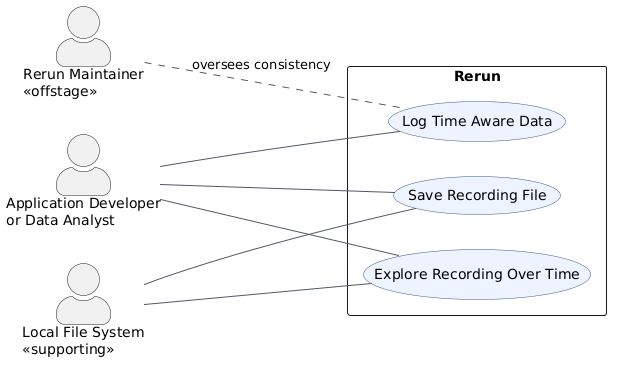

# Requirements and Use Cases

This page describes the requirements, actors, and principal use cases for Rerun, a time-aware multimodal data stack and viewer.
The descriptions below are grounded in the repository's Python SDK, Viewer implementation, documentation, and tests.

## Requirements

F1 and F2 are functional requirements because they describe capabilities the system provides.
The usability, reliability, performance, and supportability requirements are non-functional requirements because they describe qualities and constraints on those capabilities, while the plus requirements record additional integration and licensing constraints.

### Functional

**F1 — Log structured observations.**
Rerun shall let an application log structured component data under an entity path and associate temporal data with automatically generated or explicitly selected timelines.
Evidence: the Python SDK's [`log`](../rerun_py/rerun_sdk/rerun/_log.py) function accepts an entity path and component batches, handles static data, and timestamps non-static data; the [data-in guide](content/getting-started/data-in.md) demonstrates archetype logging and custom timelines.

**F2 — Open supported data sources.**
Rerun shall let a user open local recordings, blueprints, supported media files, HTTP or HTTPS recording URLs, and gRPC server URLs for inspection in the Viewer.
Evidence: the generated [CLI reference](content/reference/cli.md) lists the supported input paths and URLs, while [`command_handling.rs`](../crates/viewer/re_viewer/src/app/command_handling.rs) sends files selected through the Viewer's **Open** command to the data-loading system and provides a separate **Open URL** command.

### Usability

**U1 — Support accessible navigation and controls.**
The Viewer shall expose meaningful alternative text for action controls and allow list items to receive focus for keyboard navigation.
Evidence: [`item_buttons.rs`](../crates/viewer/re_ui/src/list_item/item_buttons.rs) uses `alt_text` for screen readers and tooltips, while [`list_item.rs`](../crates/viewer/re_ui/src/list_item/list_item.rs) requests focus on a clicked item so keyboard navigation can continue.

**U2 — Make actions and help discoverable.**
The Viewer shall provide searchable access to commands and contextual instructions so users do not have to memorize every menu location or interaction.
Evidence: the [Viewer overview](content/reference/viewer/overview.md) documents a text-searchable command palette available through `Cmd/Ctrl+P`, hover tooltips on most UI items, and view-specific help icons; [`command_palette.rs`](../crates/viewer/re_ui/src/command_palette.rs) implements fuzzy command matching and keyboard selection.

### Reliability

**R1 — Produce complete recording files by default.**
When a recording stream is closed normally, Rerun shall write a complete RRD footer by default so the recording remains suitable for random access and tools such as `LazyStore`.
Evidence: [`sinks.py`](../rerun_py/rerun_sdk/rerun/sinks.py) defaults `write_footer` to `True` and documents the consequences of omitting it; [`test_file_sink.py`](../rerun_py/tests/unit/test_file_sink.py) verifies that the default save path writes a valid stream footer.

**R2 — Recover interrupted MCAP recordings when requested.**
When an MCAP recording retains its data section but is missing its summary because writing was interrupted, Rerun shall offer an explicit recovery mode that reconstructs the same messages and time bounds as the intact recording.
Evidence: [`test_mcap_reader.py`](../rerun_py/tests/integration/test_mcap_reader.py) creates a recording truncated before its summary, verifies that `recover=True` returns the same temporal rows and time bounds as the healthy file, and verifies that normal mode reports a clear error suggesting recovery.

### Performance

**P1 — Balance logging latency and throughput.**
The SDK shall micro-batch logged data in a background thread and flush on configurable time or size thresholds to reduce metadata, bandwidth, and CPU overhead.
Evidence: the [micro-batching documentation](content/reference/sdk/micro-batching.md) specifies time, byte, and row thresholds, including the 200 ms general default and 8 ms network-sink default.

**P2 — Bound Viewer and server memory use.**
Rerun shall allow memory limits to be configured for both the Viewer and its gRPC server and shall discard the oldest buffered data when a configured limit is reached.
Evidence: the [CLI reference](content/reference/cli.md) documents `--memory-limit` for the Viewer and `--server-memory-limit` for the gRPC server, including percentage or absolute-size values and the oldest-data eviction behavior.

### Supportability

**S1 — Generate consistent APIs from shared type definitions.**
Maintainers shall be able to regenerate language-specific type code and documentation from the shared `re_type_definitions` source instead of maintaining each generated API independently.
Evidence: the [`re_types_builder` README](../crates/build/re_types_builder/README.md) states that the builder translates shared type definitions into code and translates documentation links for each target language through `pixi run codegen`.

**S2 — Extend ingestion without changing the Viewer.**
Rerun shall discover external importer executables through a documented naming convention so maintainers and users can add support for new file formats independently of the core Viewer.
Evidence: the [importer overview](content/concepts/logging-and-ingestion/importers/overview.md) documents executables on `PATH` whose names begin with `rerun-importer-`, and [`importer_external.rs`](../crates/store/re_importer/src/importer_external.rs) discovers those executables and expects them to emit RRD data through standard output.

### Plus Constraint

**C1 — Preserve the dual-license packaging constraint.**
Distributed Rerun crates shall declare the project license as `MIT OR Apache-2.0` and include both license files in packaged crates.
Evidence: the workspace package configuration in [`Cargo.toml`](../Cargo.toml) declares `MIT OR Apache-2.0` and includes `LICENSE-MIT` and `LICENSE-APACHE`.

**C2 — Interoperate through defined external interfaces.**
Rerun shall accept live recording streams over its supported `rerun://`, `rerun+http://`, and `rerun+https://` gRPC proxy URL schemes in addition to local file input.
Evidence: [`sinks.py`](../rerun_py/rerun_sdk/rerun/sinks.py) validates these URL schemes for `connect_grpc`, and the [CLI reference](content/reference/cli.md) identifies a gRPC URL as a supported Viewer input.

## Actors

- **Primary actor — Application developer or data analyst.** This person instruments an application with the Rerun SDK and uses the Viewer to understand recorded multimodal behavior over time.
- **Supporting actor — Local file system.** The file system provides durable storage for `.rrd` recordings and supplies those recordings when the Viewer opens them.
- **Offstage actor — Rerun maintainer.** The maintainer does not participate in a normal recording session, but cares that saved data is valid, the Viewer remains usable, and generated APIs stay consistent across supported languages.

## Brief Use Cases

### Log Time Aware Data

An application developer initializes a recording stream, selects an entity path and timeline position, and logs a supported archetype so Rerun can organize the observation for later visualization. This behavior is implemented by [`RecordingStream`](../rerun_py/rerun_sdk/rerun/recording_stream.py), [`log`](../rerun_py/rerun_sdk/rerun/_log.py), and the Python SDK time functions exposed through [`rerun/__init__.py`](../rerun_py/rerun_sdk/rerun/__init__.py).

### Save Recording File

An application developer selects an output path before logging, records observations, and disconnects the stream to obtain a complete `.rrd` file that can be reopened later. This behavior is implemented by [`save`](../rerun_py/rerun_sdk/rerun/sinks.py), the save and disconnect methods in [`recording_stream.py`](../rerun_py/rerun_sdk/rerun/recording_stream.py), and verified in [`test_file_sink.py`](../rerun_py/tests/unit/test_file_sink.py).

### Explore Recording Over Time

An application developer or data analyst opens a recording in the Viewer, selects its entities and timeline, and navigates through time to inspect how the visualized data changes. The file-open behavior is implemented in [`command_handling.rs`](../crates/viewer/re_viewer/src/app/command_handling.rs), and the relevant Viewer panels are described in [Navigating the Viewer](content/getting-started/configure-the-viewer/navigating-the-viewer.md) and the [Timeline reference](content/reference/viewer/timeline.md).

## Fully Dressed Use Cases

### Use Case Log Time Aware Data

**Primary Actor:** Application developer or data analyst

**Stakeholders and Interests:**

- The developer wants observations to retain their entity identity, component types, and time context.
- The maintainer wants invalid inputs to produce predictable warnings or errors rather than corrupt data.

**Preconditions:**

- The Rerun SDK is installed and imported.
- A recording stream has been initialized and is enabled.
- The actor has data representable as a Rerun archetype or described component batches.

**Success Guarantee:** The observation is submitted to the active recording under the requested entity path with either static semantics or the current timeline values.

**Main Success Scenario:**

1. The actor initializes or selects a recording stream.
2. The system establishes the active recording and application identity.
3. The actor sets the current timeline position for the observation.
4. The system records that timeline context for later log calls.
5. The actor calls `log` with an entity path and a supported archetype or component batches.
6. The system converts the input to component batches and sends them to the active recording.

**Extensions:**

- **3a. The actor does not set an application timeline:**
  1. The system timestamps non-static data automatically with `log_time` and, when enabled, `log_tick`.
- **5a. The actor marks the data as static:**
  1. The system records the components without a time value so they apply across all timelines.
- **5b. The input does not implement the required component interface and is not an iterable of described batches:**
  1. The system reports a type error, or a warning when non-strict error handling applies.

**Special Requirements:** F1, P1, and S1 apply.

**Implemented in:** [`rerun_py/rerun_sdk/rerun/_log.py`](../rerun_py/rerun_sdk/rerun/_log.py), [`rerun_py/rerun_sdk/rerun/recording_stream.py`](../rerun_py/rerun_sdk/rerun/recording_stream.py), and [`docs/content/getting-started/data-in.md`](content/getting-started/data-in.md).

### Use Case Save Recording File

**Primary Actor:** Application developer or data analyst

**Stakeholders and Interests:**

- The actor wants a durable recording that can be inspected after the originating program exits.
- The local file system needs a valid path and sufficient capacity.
- The maintainer wants the normal save path to produce a complete, efficiently readable file.

**Preconditions:**

- A recording stream has been initialized and is enabled.
- The actor can write to the selected destination.
- The save sink is selected before observations are logged.

**Success Guarantee:** A valid `.rrd` recording containing the logged observations is stored at the selected path and, by default, ends with a complete stream footer.

**Main Success Scenario:**

1. The actor selects a writable `.rrd` path.
2. The actor calls `save` for the active recording before logging data.
3. The system creates a file sink using the recording's application identity.
4. The actor logs one or more observations.
5. The system streams the encoded observations to the selected file.
6. The actor disconnects or closes the recording stream.
7. The system finalizes the sink and writes the default RRD footer.

**Extensions:**

- **2a. Recording is disabled:**
  1. The system ignores the save request and logs a warning explaining that initialization is required.
- **3a. No application ID is available:**
  1. The system raises a `ValueError` and does not create the recording sink.
- **7a. The actor chooses `write_footer=False` for a long-running stream:**
  1. The system closes a valid footerless RRD file.
  2. The system leaves random-access performance degraded until a footer is added with `rerun rrd optimize`.

**Special Requirements:** R1, P1, and C1 apply.

**Implemented in:** [`rerun_py/rerun_sdk/rerun/sinks.py`](../rerun_py/rerun_sdk/rerun/sinks.py), [`rerun_py/rerun_sdk/rerun/recording_stream.py`](../rerun_py/rerun_sdk/rerun/recording_stream.py), and [`rerun_py/tests/unit/test_file_sink.py`](../rerun_py/tests/unit/test_file_sink.py).

### Use Case Explore Recording Over Time

**Primary Actor:** Application developer or data analyst

**Stakeholders and Interests:**

- The actor wants to inspect recorded entities at specific points in time without altering the source recording.
- The local file system must provide the selected recording to the Viewer.
- The maintainer wants file loading and navigation controls to behave predictably and remain accessible.

**Preconditions:**

- The Rerun Viewer is running.
- A readable recording file or supported recording URL is available.
- The recording contains at least one displayable entity.

**Success Guarantee:** The Viewer loads the recording and presents its entities at the time selected by the actor.

**Main Success Scenario:**

1. The actor invokes **Open file** in the Viewer.
2. The system displays the native file chooser.
3. The actor selects a readable `.rrd` recording.
4. The local file system returns the selected file.
5. The system opens and selects the recording and creates compatible views for its contents.
6. The actor selects a timeline and moves the time cursor.
7. The system updates the views to show data at the selected time.
8. The actor selects an entity or component to inspect its details.
9. The system displays the selection's applicable properties and data.

**Extensions:**

- **3a. The actor cancels the file chooser:**
  1. The system closes the chooser and keeps the current Viewer state.
- **3b. The actor provides a supported URL instead of a local file:**
  1. The system parses the URL through the normal open flow and opens the referenced recording.
- **5a. The selected source cannot be opened or decoded:**
  1. The system reports the loading error and does not replace the current recording with invalid data.

**Special Requirements:** U1 and R1 apply.

**Implemented in:** [`crates/viewer/re_viewer/src/app/command_handling.rs`](../crates/viewer/re_viewer/src/app/command_handling.rs), [`crates/viewer/re_viewer_context/src/open_url.rs`](../crates/viewer/re_viewer_context/src/open_url.rs), [`docs/content/getting-started/configure-the-viewer/navigating-the-viewer.md`](content/getting-started/configure-the-viewer/navigating-the-viewer.md), and [`docs/content/reference/viewer/timeline.md`](content/reference/viewer/timeline.md).

## Use Case Diagram

The editable diagram source is [`requirements-use-cases.puml`](requirements-use-cases.puml).

## AI Use Log

| Date | Tool | How AI Was Used | Verification Performed |
| --- | --- | --- | --- |
| 2026-09-16 | OpenAI Codex | Extracted the assignment requirements and proposed FURPS+ requirements, actors, brief use cases, fully dressed use cases, and a PlantUML diagram for Rerun. | Checked every functional step and requirement against the repository files linked throughout this page. Confirmed `main` matched `origin/main` after fetching. Verified the save/footer behavior against `sinks.py` and `test_file_sink.py`; logging behavior against `_log.py` and `recording_stream.py`; file-open behavior against `command_handling.rs` and `open_url.rs`; timeline behavior against the Viewer documentation; accessibility behavior against `item_buttons.rs` and `list_item.rs`; micro-batching against its reference documentation; code generation against `re_types_builder/README.md`; and licensing against `Cargo.toml`. |
| 2026-09-17 | OpenAI Codex | Added a second requirement to every FURPS+ category and clarified the distinction between functional requirements, non-functional requirements, and plus constraints. | Verified file and URL loading against `command_handling.rs` and the CLI reference; command discovery against the Viewer overview and `command_palette.rs`; interrupted MCAP recovery against `test_mcap_reader.py`; memory limits against the CLI reference; external importer extensibility against the importer overview and `importer_external.rs`; and gRPC URL schemes against `sinks.py`. |
