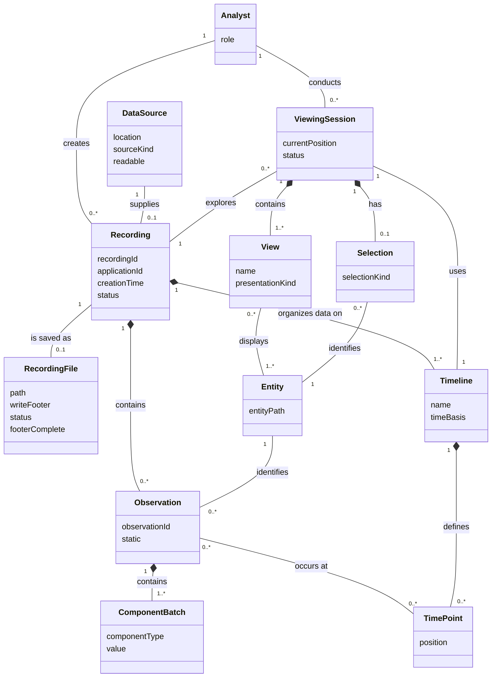

# SSDs and Operation Contracts

This page refines the domain model from the three fully dressed use cases and translates each main success scenario into a system sequence diagram.
The operation contracts then state the domain changes caused by one important system event from each SSD.

## Noun Phrase Analysis

Repeated forms of the same concept are consolidated into one row.
Interface and implementation terms are classified as neither because they do not belong in a conceptual domain model.

| Noun phrase | Found in | Decision | Why |
| --- | --- | --- | --- |
| application developer; data analyst; actor | All three use cases | Conceptual class: `Analyst` | A real person who records or explores data; `role` distinguishes how the person participates. |
| observation | Log, Save | Conceptual class: `Observation` | A durable recorded fact with identity and associations. |
| entity; entity identity | Log, Explore | Conceptual class: `Entity` | A domain object identified by an entity path and described by observations. |
| entity path | Log; SSD events | Attribute of `Entity` | Text that identifies an entity. |
| component batch; component data; component type | Log | Conceptual class: `ComponentBatch`; `componentType` and `value` are attributes | A typed unit of observation data has identity and participates in composition with an observation. |
| archetype | Log | Neither | A software API/schema used to construct component batches, not a separate real-world domain object in these scenarios. |
| recording; active recording | All three use cases | Conceptual class: `Recording` | A collection of observations organized on timelines. |
| recording ID; application ID; creation time; status | Log, Save | Attributes of `Recording` | Scalar values that describe or identify a recording. |
| recording stream; SDK | Log, Save | Neither | Software mechanisms inside the system boundary. |
| timeline | Log, Explore | Conceptual class: `Timeline` | A named temporal axis that organizes observations. |
| timeline name; time basis | Log, Explore | Attributes of `Timeline` | Scalar descriptions of a timeline. |
| timeline position; time value; timestamp; time cursor | Log, Explore | Conceptual class: `TimePoint`; `position` is an attribute | A position participates in associations between observations and a timeline; the cursor itself is a UI mechanism. |
| static semantics; static flag | Log | Attribute `Observation.static` | A Boolean property of an observation. |
| warning; error; type error; error handling | Log, Save, Explore | Neither | System responses and software behavior, not domain state. |
| local file system | Save, Explore | Neither | A supporting actor outside the system, not a class maintained by the system. |
| output path; selected destination; file path | Save | Attribute `RecordingFile.path` | Text naming where a recording file is stored. |
| recording file; `.rrd` file | Save, Explore | Conceptual class: `RecordingFile` | A persistent artifact with its own path and completion state. |
| footer; `write_footer`; footer complete | Save | Attributes of `RecordingFile` | Values describing how the recording file is finalized. |
| file sink; save sink | Save | Neither | Internal software that writes a recording file. |
| data source; recording URL; source location | Explore | Conceptual class: `DataSource`; `location`, `sourceKind`, and `readable` are attributes | A file or URL supplies a recording to a viewing session. |
| Viewer; native file chooser; Open file command | Explore | Neither | The system and its interface controls, not domain concepts. |
| viewing session | Explore | Conceptual class: `ViewingSession` | Holds the analyst's current recording, timeline, position, views, and selection. |
| current position; session status | Explore | Attributes of `ViewingSession` | Scalar state of a viewing session. |
| view; compatible view | Explore | Conceptual class: `View` | A presentation of one or more entities in a viewing session. |
| view name; presentation kind | Explore | Attributes of `View` | Scalar descriptions of a view. |
| selection | Explore | Conceptual class: `Selection` | A session-owned choice associated with an entity. |
| selection kind | Explore | Attribute of `Selection` | A scalar description of what is selected. |
| properties; displayed data | Explore | Neither | Information derived from existing domain objects, not a separately tracked concept in these use cases. |
| Rerun maintainer | All three use cases | Neither | An offstage stakeholder who influences requirements but does not participate in the modeled scenarios. |

## Updated Domain Model



An observation is a recorded fact about one entity and contains one or more typed component batches.
A non-static observation is associated with time points on timelines, while a static observation applies across every position.
A recording groups observations and may be persisted as a recording file or loaded from another data source.
An analyst explores a recording in a viewing session whose current timeline, cursor position, views, and optional selection capture the state described by the exploration use case.

Compared with the initial model, this version replaces the broad `ObservedSubject` concept with Rerun's use-case term `Entity`, separates typed component data into `ComponentBatch`, and represents timeline positions as `TimePoint` instances.
It also adds `RecordingFile` for the save use case and `ViewingSession` plus `Selection` for the exploration use case.
These changes let the SSD operations and contracts refer only to classes, attributes, and associations that appear in the model.

The editable diagram source is [`updated-domain-model.mmd`](updated-domain-model.mmd).

## SSD for Log Time Aware Data

```mermaid
sequenceDiagram
    actor Actor as Application Developer or Data Analyst
    participant S as :RerunSystem
    Actor->>S: initializeRecording(applicationId)
    S-->>Actor: recordingId
    Actor->>S: setTimelinePosition(timelineName, position)
    S-->>Actor: timeline context accepted
    loop each observation
        Actor->>S: logObservation(entityPath, componentBatches, isStatic)
        S-->>Actor: observationId
    end
```

The editable diagram source is [`log-time-aware-data-ssd.mmd`](log-time-aware-data-ssd.mmd).

### Operation Contract for logObservation

**Operation:** `logObservation(entityPath: String, componentBatches: ComponentBatch[*], isStatic: Boolean)`

**Cross-references:** Use Case Log Time Aware Data, main success scenario steps 5-6; extensions 5a and 5b

**Preconditions:**

- An enabled `Recording` is active for the `Analyst`.
- `componentBatches` contains one or more valid `ComponentBatch` values.
- If `isStatic` is false, the active `Recording` has at least one current `TimePoint` associated with a `Timeline`.

**Postconditions:**

- An `Observation` instance was created.
- `Observation.observationId` was set to a new unique value.
- `Observation.static` was set to `isStatic`.
- The `Observation` was associated with the active `Recording`.
- If no `Entity` with `Entity.entityPath` equal to `entityPath` existed, an `Entity` instance was created and `Entity.entityPath` was set to `entityPath`.
- The `Observation` was associated with the `Entity` whose `Entity.entityPath` equals `entityPath`.
- One or more `ComponentBatch` instances were created from `componentBatches`.
- Each new `ComponentBatch.componentType` and `ComponentBatch.value` was set from the corresponding value in `componentBatches`.
- Each new `ComponentBatch` was associated with the `Observation`.
- If `isStatic` is false, the `Observation` was associated with each current `TimePoint`; if `isStatic` is true, no `TimePoint` association was formed.

## SSD for Save Recording File

```mermaid
sequenceDiagram
    actor Actor as Application Developer or Data Analyst
    participant S as :RerunSystem
    Actor->>S: saveRecording(path, writeFooter)
    S-->>Actor: save destination accepted
    loop one or more observations
        Actor->>S: logObservation(entityPath, componentBatches, isStatic)
        S-->>Actor: observationId
    end
    Actor->>S: disconnectRecording()
    S-->>Actor: saved file path
```

The editable diagram source is [`save-recording-file-ssd.mmd`](save-recording-file-ssd.mmd).

### Operation Contract for saveRecording

**Operation:** `saveRecording(path: FilePath, writeFooter: Boolean)`

**Cross-references:** Use Case Save Recording File, main success scenario steps 1-3; extensions 2a and 3a

**Preconditions:**

- An enabled `Recording` is active.
- `Recording.applicationId` is set.
- `path` identifies a writable destination.
- The active `Recording` is not already associated with a `RecordingFile`.

**Postconditions:**

- A `RecordingFile` instance was created.
- `RecordingFile.path` was set to `path`.
- `RecordingFile.writeFooter` was set to `writeFooter`.
- `RecordingFile.status` was set to `open`.
- `RecordingFile.footerComplete` was set to `false`.
- The `RecordingFile` was associated with the active `Recording`.

## SSD for Explore Recording Over Time

```mermaid
sequenceDiagram
    actor Actor as Application Developer or Data Analyst
    participant S as :RerunSystem
    Actor->>S: requestOpenRecording()
    S-->>Actor: source selection requested
    Actor->>S: openRecording(sourceLocation)
    S-->>Actor: recording summary and compatible views
    loop while exploring time
        Actor->>S: moveTimeCursor(timelineName, position)
        S-->>Actor: views at selected time
    end
    Actor->>S: selectEntity(entityPath)
    S-->>Actor: applicable properties and data
```

The editable diagram source is [`explore-recording-over-time-ssd.mmd`](explore-recording-over-time-ssd.mmd).

### Operation Contract for openRecording

**Operation:** `openRecording(sourceLocation: SourceLocation)`

**Cross-references:** Use Case Explore Recording Over Time, main success scenario steps 3-5; extensions 3b and 5a

**Preconditions:**

- An `Analyst` is using the running system.
- A readable `DataSource` exists with `DataSource.location` equal to `sourceLocation`.
- The `DataSource` supplies a `Recording` that contains at least one displayable `Entity`.

**Postconditions:**

- A `ViewingSession` instance was created.
- `ViewingSession.status` was set to `open`.
- `ViewingSession.currentPosition` was set to the initial position of the default `Timeline`.
- The `ViewingSession` was associated with the `Analyst`.
- The `ViewingSession` was associated with the `Recording` supplied by the `DataSource`.
- The `ViewingSession` was associated with the default `Timeline` of the `Recording`.
- One or more compatible `View` instances were created.
- Each new `View` was associated with the `ViewingSession`.
- Each new `View` was associated with one or more displayable `Entity` instances from the `Recording`.

## AI Use Log

| Date | Tool | How AI Was Used | Verification Performed |
| --- | --- | --- | --- |
| 2026-09-23 | OpenAI Codex | Classified noun phrases, refined the conceptual domain model, translated the three fully dressed use cases into SSDs, and drafted one operation contract for a state-changing event in each SSD. | Checked every SSD message against the corresponding main success scenario and extension steps. Checked every class, attribute, and association named in the contracts against the updated domain model. Checked the three SSDs for one primary actor, one black-box system participant, operation-style event names with parameters, dashed return messages, and loop frames for repeated behavior. |
